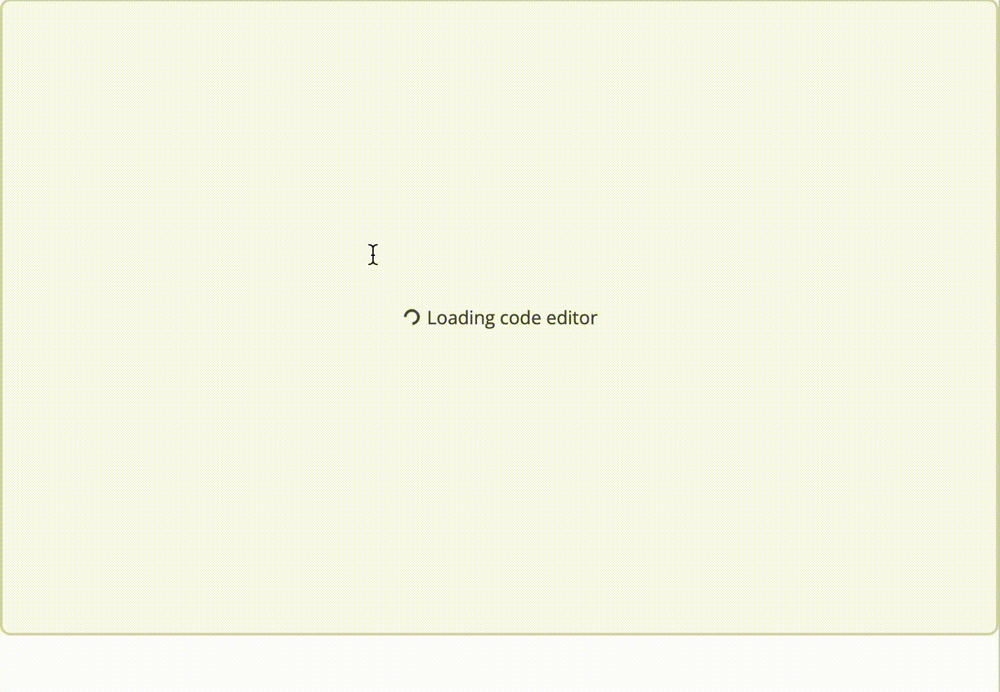

# CodeEditorAutocomplete

> author: Eugene Yevhen Andruszczenko

> github: @32teeth

> email: eugene.andruszczenko@gmail.com

### Overview
In it’s current state as of writing *([Cloudscape Design System](https://refresh.polaris.a2z.com/) / Polaris)* has a `<CodeEditor>` component which extends the [Cloud9 Ace Editor](https://ace.c9.io/) with additional features and component rich presentation for toolbar panel, language line and annotation along with an encapsulated theme selector. The rich text editor additionally feature extensive API, but leaves any context and support directly related to Ace up to the consumer of the `<CodeEditor>`

One drawback of using the offered `<CodeEditor>` is it’s direct capability to extend with completions (triggers, snippets and typeahead) features almost expected from today’s web based editors.

### Goal


### Running
```
npm i
npm start
```
### Viewing
[Open you local browser to :5001](http://localhost:5001/)